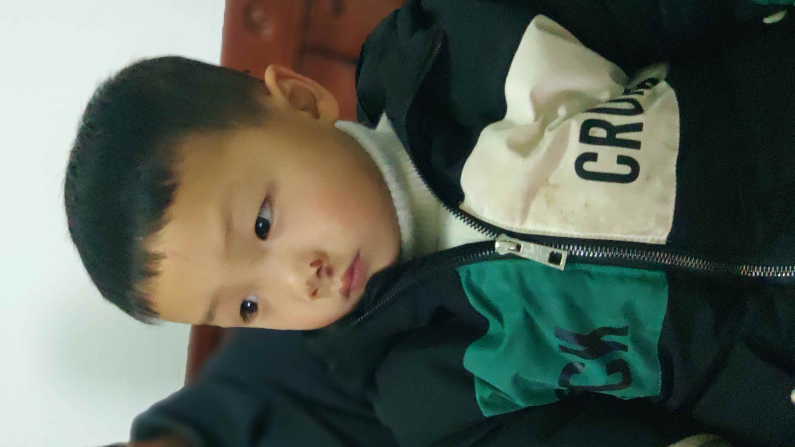

> 不要和朋友合伙创业
>> 他可能没把你当朋友，更没把你当合伙人

2019年7月，我离开了上家公司，没有找下家。给自己预留了两到三个月的时间，用来补齐短板，深入学习感兴趣的领域。

<!-- 前 leader 是我进入工业界编程的领路人，16年在 Ruff，跟着他做了4个多月的前端，那时候公司氛围很好，折腾了不少东西。虽说现在不再做前端，但领悟到的编程思想，至今受用。 -->

刚离职的那段时间，由于要找社保代缴，而我又信不过那些代缴机构。看了好多关于社保相关的文章，搞得我有点焦虑。“这样子不行的呀！再焦虑下去，不就是在白白浪费宝贵的时间吗？”强迫自己摒弃焦虑，调整作息时间，投入到生活和学习中。

考虑到待在房间里容易焦虑，决定不点外卖，每次都出去吃。吃完就去书店、咖啡厅、学校图书馆等能自习的地方。晚上回来之后，就刷刷 leetcode，看看当天的新闻。

现在回顾这段时间，其实是我2019年的高光时刻。算法再也不会是我的短板; 编程语言对我来说已经无所谓，除非我不喜欢它们的设计；Computer Networking 和 Operating System 也不再是一个黑盒，揭开它们神秘的面纱之后，遗留的困惑也一个个烟消云散；有了网络和 Linux 的基础，Kubernetes 的内部实现机制再也不是管中窥豹。

我们玩拼图的时候，当补全了关键的片块，剩下的就很容易完成；学习也是如此，当构建好了一个知识体系框架，可以做到有的放矢，学习新东西自然特别快了，阅读速度也有大幅的提升。良性循环带来了自信，帮助我拿下一个又一个 offer.

最后我选择了 [Shopee](https://shopee.com/)，base 在深圳。要离开生活了6年多的上海，离开这段时间不离不弃的老朋友，离开自己的母校，内心十分的不舍。

在上海的最后几天，把一些看过的书捐给了学校的图书馆；联系好京东物流，把行李寄到深圳；参加了PyCon 2019, 居然也敢在几千人的大会上，用英文提问了; 和朋友、同学道别；特意买了公务舱，飞去了深圳。现在回想起来，那时候时间很紧，自己能够很好地处理一连串的事情，完成跨城市搬家，很强。

## 总结

想起我那淘气的侄子，因为爱玩，摔了好多次。

即使脸上挂彩不少，每次摔跤，还是会自己爬起来，“叔叔，没关系，摔一跤没事的”。有时候，他真是我的精神支柱。想要做一位优秀的叔叔，培养一位优秀的侄子，哈哈哈哈！

2020, 若能逃过肺炎疫情这一劫，我想要甜甜的恋爱！